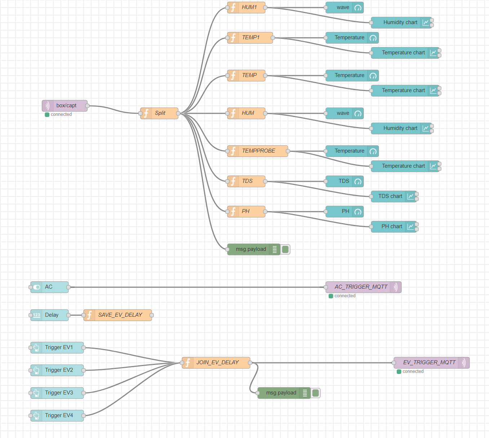

# MQTT BOX Project

## Run project
- install PlatformIO
- install CP210x drivers
- git clone https://github.com/valentinmaxime/MQTT_BOX.git

## Node red backup
Last state capture:

[Can also be found in json here](nodered/backup.json)
